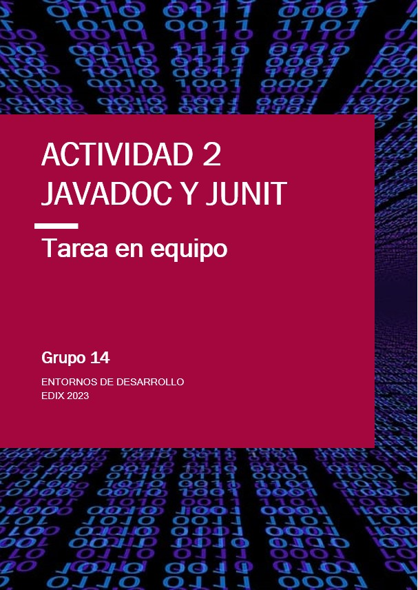
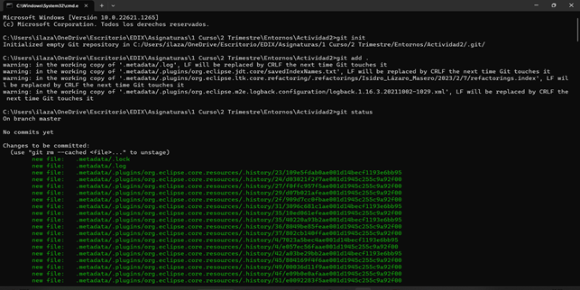
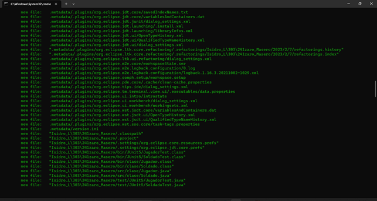
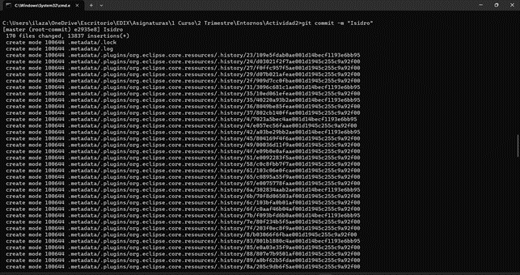
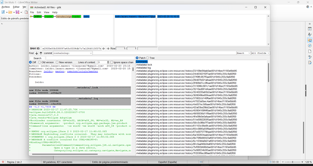



# ACTIVIDAD 2
## Tarea en equipo. JavaDoc y JUnit

Este es el documento formal requerido para la entrega de la actividad 2 de la asignatura "Entornos de Desarrollo" del primer curso del ciclo de Formación Profesional DAW en la escuela EDIX 2023.
# GRUPO 16

Este trabajo corresponde al Grupo 14, que está formado por:

 - Isidro Lázaro Masero
 - Julián Méndez Podadera
 - Pablo Segura Barranco
 - Enrique Vázquez Iriarte

 El profesor  es Félix de Pablo.

# URL DEL REPOSITORIO

https://github.com/JulianMendezEdix/AD2_Entornos_Gr17

# COMENTARIOS Y EXPLICACIONES

## Julián

Creo el repositorio en github y hago el primer commit en el main con un proyecto java que incluye el código de la práctica. Añado como colaborador a Isidro. Y creo una rama para mi desarrollo y la llamo 'julian'.

Hago la documentación javadoc:

Y las pruebas unitarias con Junit5:

Hago commit y hago push en mi rama 'julian' de desarollo.

El día de la entrega, añado como colaborador a Pablo que me lo pide. Hablamos en el grupo y decidimos poner el trabajo X en el main y copio y pego todos nuestros comentarios en este archivo .md. Y hago una portada.

## Isidro

Una vez creada las dos clases Jugador y Soldado las he comentado con JavaDoc y he realizado las clases Test de cada una de ella, realizando sus pruebas unitarias mediante JUnit5.

He creado mi repositorio local y lo he añadido al repositorio de GitHub:

https://github.com/JulianMendezEdix/AD2_Entornos_Gr17

Vamos a ver los pasos dados, para llegar a crear mi rama en el proyecto de GitHub:

Primero realizo un GitHub para ver todos los archivos que se han añadido:

Creo una commit con el nombre de Isidro para añadir todos los archivos:

Nos situamos sobre la rama master, y creamos la rama isidro y hacemos que nos mande a ella.
Después enlazamos nuestro repositorio local con el remoto.
Por último añadimos los datos de nuestro repositorio local.

Podemos ver mi rama creada junta a la rama Máster, que se irá modificando según vayan haciendo las siguientes ramas mis compañeros.

## Conclusiones grupales

# FIN

